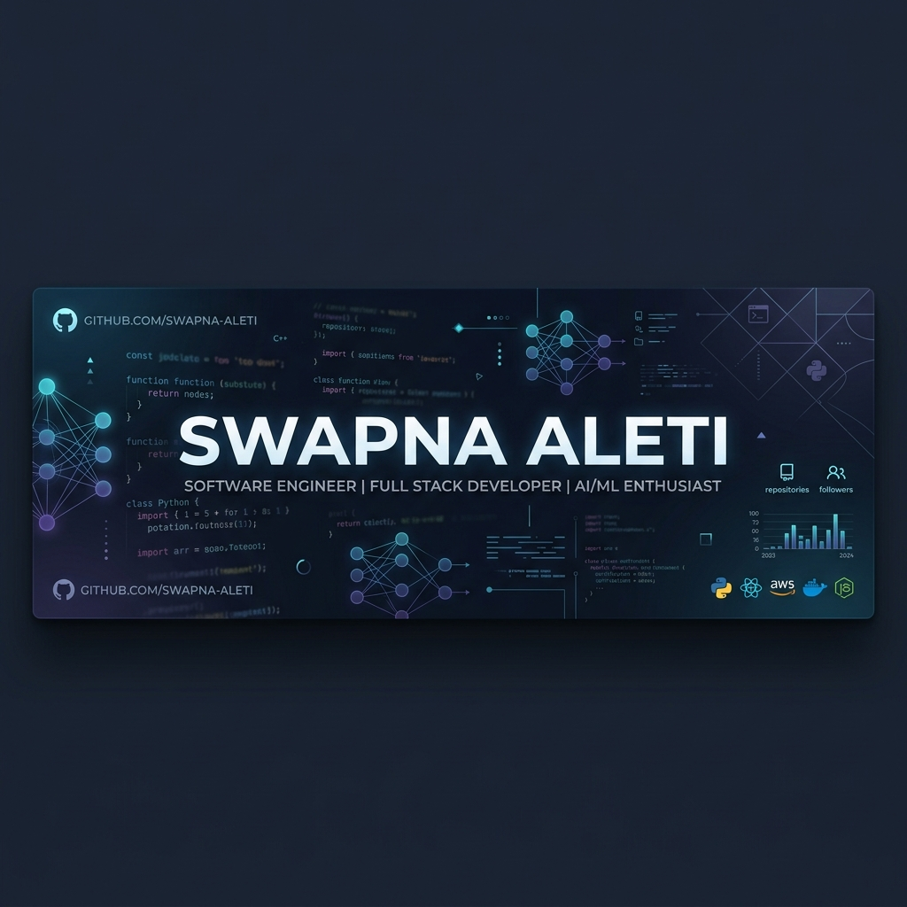
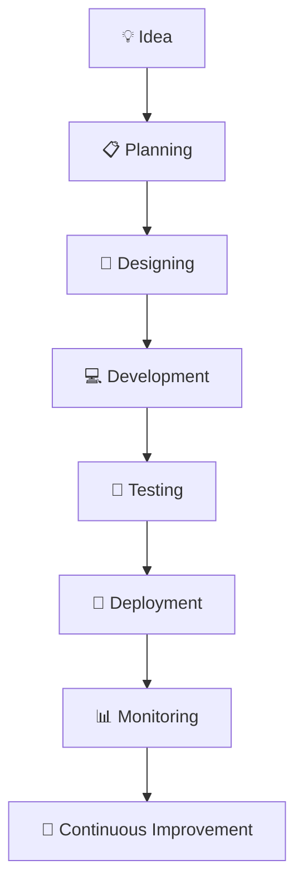

  

# 👋 Hi there, I'm Swapna Aleti
### Software Engineer | Full Stack Developer | AI Enthusiast

I'm an aspiring Software Developer passionate about **Full-Stack Development**, **AI/ML**, and building impactful software solutions.

🌱 **Always learning something new**  
💻 **Building scalable web applications**  
🤖 **Exploring Machine Learning & AI Agents**  
🚀 **Solving real-world problems through technology**  
💼 **Passionate about building a career in the IT Industry**

---

## 📬 Let's Connect

  
  <!-- Update this link when you add your LinkedIn! -->
  

---

## 🛠️ Tech Arsenal

### 💻 Programming Languages

### 🎨 Frontend Development

### ⚙ Backend Development

### 🤖 AI, Machine Learning & Libraries

### 🗄 Databases & Cloud

---

## 📈 Technical Skills Acquired

| Category | Skills |
|----------|--------|
| **IDE** | VS Code, Jupyter Notebook |
| **Version Control** | Git, GitHub |
| **API Testing** | Postman |
| **Deployment** | Vercel, Render |
| **Database** | MongoDB Atlas, PostgreSQL |

---

## 🏆 Major Achievements
- ✅ Built Multiple AI & Full Stack Projects
- ✅ Exploring Generative AI & LLMs
- ✅ Practicing Data Structures & Algorithms
- ✅ Continuous Open Source Learner

---

## 🎯 Current Goals
- ✔ Master Data Structures & Algorithms
- ✔ Become an Expert Full Stack Developer
- ✔ Build Production-Level AI Applications
- ✔ Contribute to Open Source
- ✔ Secure a Software Engineer / AI Engineer Role

---

## 📊 GitHub Analytics

  

  

---

## 🚀 Development Workflow

---

## 🛠 My Development Philosophy
- Write clean code.
- Build useful products.
- Learn continuously.
- Never stop improving.
- Consistency beats motivation.

---

## 📌 Developer Quote
> *"First, solve the problem. Then, write the code."*  
> — John Johnson

---

## 💼 Open for Opportunities
**Open To:**
✔ Software Engineer  
✔ Full Stack Developer  
✔ AI/Machine Learning Engineer  
✔ Frontend/Backend Roles  
✔ Internship Opportunities  

---

  
**🌟 Thanks for Visiting My Profile! 🌟**

*If you like my projects, don't forget to ⭐ star my repositories!*

